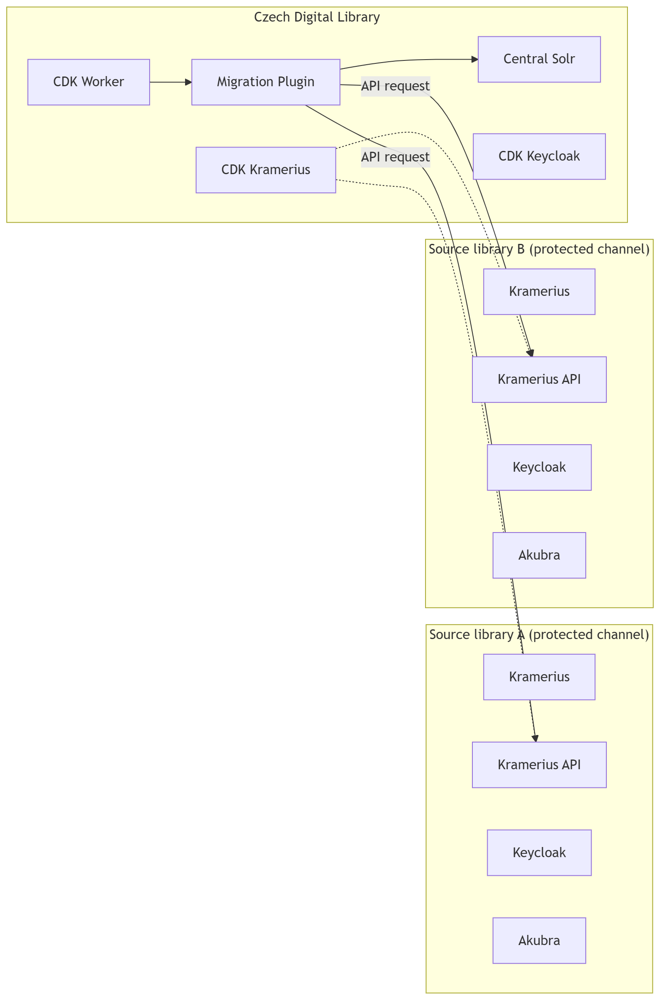
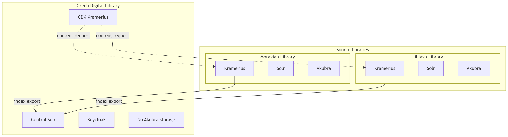

[Index](../../index) / [Architektura](../../architecture) 

# CDK

Česká digitální knihovna (CDK) je centrální agregační a přístupová vrstva nad více nezávislými instancemi systému Kramerius.

CDK není úložiště digitálních dat. Funguje jako:

- indexační vrstva
- vyhledávací platforma
- federovaný přístupový bod k obsahu

Zdrojové knihovny zůstávají plně autonomní a uchovávají digitální objekty.

---

## Zakladni diagram

## CDK aggregacni model

## Komponenty

CDK se skládá z následujících hlavních komponent:

### CDK Worker
Komponenta, která:

- spouští asynchronní procesy
- řídí Migration plugin
- plánuje inkrementální aktualizace indexu

---

### Migration Plugin

Asynchronní indexační proces, který:

- běží v CDK prostředí
- je spouštěn CDK Workerem
- přistupuje ke zdrojovým knihovnám přes Kramerius API
- provádí:
    - export metadat
    - transformaci dat
    - indexaci do CDK Solru

Migration je opakovaný proces (incremental synchronization).

---

### CDK Kramerius Runtime

Runtime vrstva CDK, která:

- zajišťuje vyhledávání a přístup k obsahu
- zpracovává uživatelské požadavky
- načítá digitální obsah ze zdrojových knihoven přes API

---

### Central Solr

Centrální vyhledávací index CDK:

- obsahuje metadata všech připojených knihoven
- neobsahuje plné digitální objekty
- je aktualizován Migration procesem

---

### Keycloak (CDK)

Autentizační a autorizační vrstva CDK:

- správa uživatelů
- řízení přístupů
- integrace s externími identity providery

---

## Responsibility model

Architektura CDK je postavena na jasném oddělení odpovědností:

### CDK odpovídá za:
- agregaci metadat
- indexaci
- vyhledávání
- řízení přístupu k obsahu

### Source libraries odpovídají za:
- uchovávání digitálních objektů
- poskytování API
- autentizovaný přístup k obsahu

CDK **nevlastní digitální data**.

---

## Integration model

Integrace mezi CDK a zdrojovými knihovnami je realizována přes:

### Kramerius API

Jednotné rozhraní pro:

- metadata retrieval
- strukturu dokumentů
- digitální obsah (stránky, obrazy, PDF)

---

### Protected channel model

Zdrojová knihovna se po konfiguraci stává tzv. **protected channel**:

1. knihovna vygeneruje API klíč
2. tento klíč je uložen v konfiguraci CDK
3. CDK používá tento klíč pro:
    - Migration procesy
    - runtime přístup k obsahu

Protected channel je tedy:
> konfigurační stav zdrojové knihovny umožňující autentizovaný přístup z CDK

---

## Data flows

### Migration flow (indexace)

1. CDK Worker spustí Migration plugin
2. Migration se připojí ke zdrojovým knihovnám přes API
3. použije API klíč (protected channel)
4. stáhne metadata a strukturu dokumentů
5. transformuje data
6. uloží je do Central Solr

Výsledkem je centrální index CDK.

---

### Runtime flow (uživatelský přístup)

1. uživatel provede dotaz v CDK
2. CDK Kramerius vyhodnotí výsledek ze Solru
3. při otevření dokumentu:
    - CDK identifikuje zdrojovou knihovnu
    - provede API request přes protected channel
    - načte digitální obsah
4. obsah je streamován zpět uživateli

---

## Key architectural properties

### 1. Decoupling storage and indexing
CDK neobsahuje digitální úložiště, pouze indexuje a zprostředkovává přístup.

---

### 2. API-first integration
Veškerá komunikace se zdrojovými knihovnami probíhá přes Kramerius API.

---

### 3. Secure federation model
Přístup je řízen pomocí API klíčů (protected channels).

---

### 4. Asynchronous indexing
Indexace je oddělená od runtime přístupu a probíhá batchově.

---

## Navazujici dokumentace

- ➡️ [Reference](../../reference/cdk)
