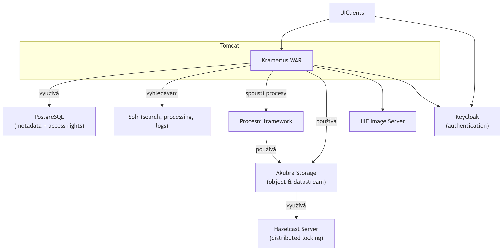

[Index](../index.md)

# 🏗️ Architektura

Tato část dokumentace popisuje systémovou architekturu Krameria:

- hlavní komponenty
- jejich odpovědnosti
- komunikační toky
- integrační vrstvy
- runtime vztahy mezi službami

Cílem této části není detailní konfigurace jednotlivých komponent, ale pochopení:

- jak jsou části systému propojeny
- jaké mají odpovědnosti
- jak probíhá zpracování dat
- jaké jsou hlavní architektonické principy

---

## Hlavní komponenty

Systém typicky obsahuje následující komponenty:

| Komponenta               | Účel                             |
|--------------------------|----------------------------------|
| Kramerius Core           | REST API, integrace              |
| Reader UI                | uživatelské rozhraní pro čtenáře |
| Admin UI                 | administrace systému             |
| Keycloak                 | autentizace                      |
| Solr                     | vyhledavani                      |
| Fedora / Akubra          | repository a storage             |
| Image Server             | poskytování obrazových dat       |
| Process Platform Manager | orchestrace background procesů   |
| Process Platform Worker  | zpracování tasků                 |
| PostgreSQL               | persistence                      |
| Hazelcast                | distribuované zámky              |

---

Kramerius Core je **WAR soubor**, který běží typicky v aplikačním serveru **Tomcat**. Aplikace využívá několik externích a interních modulů pro správu dat, vyhledávání, autentizaci a orchestrace procesů.

## Dílčí pohledy

### [Kramerius Core](core/index.md)
### [Vyhledávání](search/index.md)
### [Zabezpečení](security/index.md)
### [Asynchronní procesy](process-platform/index.md)
### [ČDK](cdk/index.md)

---

## Architektonické vrstvy

Kramerius je modulární distribuovaný systém složený z několika hlavních vrstev.

| Vrstva      | Odpovědnost              |
|-------------|--------------------------|
| Core        | REST API, integrator     |
| UI          | Reader a Admin aplikace  |
| API         | hlavní aplikační backend |
| Security    | autentizace a autorizace |
| Search      | indexace a vyhledávání   |
| Processing  | background processing    |
| Storage     | digitální repository     |
| Media       | image a audio služby     |
| Persistence | PostgreSQL databáze      |

---

## Architektonické principy

Kramerius používá několik základních architektonických principů.

### Oddělení odpovědností

Jednotlivé komponenty mají oddělené odpovědnosti:

- autentizace
- autorizace
- search
- processing
- storage
- image serving

---

### Stateless API

Backend je navržen jako stateless služba.

Autentizace je založena na:

- OIDC
- Bearer tokenech
- JWT validaci

---

### Externí infrastruktura

Některé klíčové části systému jsou externí služby:

- Keycloak
- Solr
- PostgreSQL
- image server

---

### Asynchronní processing

Dlouhotrvající operace jsou odděleny od hlavního backendu.

Processing infrastruktura používá:

- Process Platform
- worker model
- queue-like orchestration

---

### Modulární architektura

Jednotlivé subsystémy mohou být:

- škálovány nezávisle
- nasazovány samostatně
- nahrazovány jinou implementací

---

## Hlavní datové toky

Systém obsahuje několik důležitých datových toků.

### Import pipeline

Import typicky probíhá:

XML metadata
↓
Akubra storage
↓
Search indexace
↓
Search API

---

### Search flow

Vyhledávání probíhá:

UI
↓
Kramerius API
↓
Solr
↓
Search response

---

### Image flow

Obrazová data jsou poskytována:

UI viewer
↓
Kramerius API
↓
IIIF image server

---

### Authentication flow

Autentizace používá:

UI
↓
Keycloak
↓
OIDC token
↓
Kramerius API

---

### Processing flow

Background processing používá:

Process Manager
↓
Worker
↓
Repository / Search / Storage

---

## Shrnutí

Kramerius je distribuovaný modulární systém složený z oddělených služeb pro:

- storage
- search
- security
- processing
- image serving
- persistence

Jednotlivé komponenty spolu komunikují pomocí REST API a sdílené persistence vrstvy.

## Navazujici dokumentace

- ➡️ [Reference](../reference/index.md)
- ➡️ [Konfigurace](../configuration/index.md)

