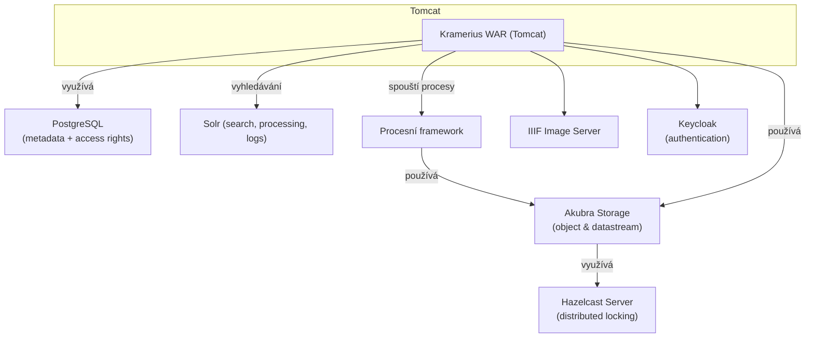

# Architecture

## Přehled

Tato část dokumentace popisuje systémovou architekturu Krameria:

- hlavní komponenty
- jejich odpovědnosti
- komunikační toky
- integrační vrstvy
- runtime vztahy mezi službami

Architektura zahrnuje:

- hlavní runtime komponenty
- komunikační toky
- integrační vrstvy
- processing pipeline
- storage model
- bezpečnostní architekturu
- search infrastrukturu

Cílem této části není detailní konfigurace jednotlivých komponent, ale pochopení:

- jak jsou části systému propojeny
- jaké mají odpovědnosti
- jak probíhá zpracování dat
- jaké jsou hlavní architektonické principy

---

## Architektonické vrstvy

Kramerius je modulární distribuovaný systém složený z několika hlavních vrstev.

| Vrstva | Odpovědnost |
|---|---|
| UI | Reader a Admin aplikace |
| API | hlavní aplikační backend |
| Security | autentizace a autorizace |
| Search | indexace a vyhledávání |
| Processing | background processing |
| Storage | digitální repository |
| Media | image a audio služby |
| Persistence | PostgreSQL databáze |

---

## Hlavní komponenty

Systém typicky obsahuje následující komponenty:

| Komponenta | Účel |
|---|---|
| Kramerius backend | hlavní business logika |
| Reader UI | uživatelské rozhraní pro čtenáře |
| Admin UI | administrace systému |
| Keycloak | autentizace |
| Solr | search index |
| Fedora / Akubra | repository a storage |
| Image Server | poskytování obrazových dat |
| Process Platform | orchestrace background procesů |
| Worker služby | zpracování tasků |
| PostgreSQL | persistence |
| Hazelcast | distribuované locky |

---

## Diagram

Kramerius je dodáván jako **WAR soubor**, který běží v aplikačním serveru **Tomcat**. Aplikace využívá několik externích a interních modulů pro správu dat, vyhledávání, autentizaci a orchestrace procesů.

---

## Architektonické principy

Kramerius používá několik základních architektonických principů.

### Oddělení odpovědností

Jednotlivé komponenty mají oddělené odpovědnosti:

- autentizace
- autorizace
- search
- processing
- storage
- image serving

---

### Stateless API

Backend je navržen jako stateless služba.

Autentizace je založena na:

- OIDC
- Bearer tokenech
- JWT validaci

---

### Externí infrastruktura

Některé klíčové části systému jsou externí služby:

- Keycloak
- Solr
- PostgreSQL
- image server

---

### Asynchronní processing

Dlouhotrvající operace jsou odděleny od hlavního backendu.

Processing infrastruktura používá:

- Process Platform
- worker model
- queue-like orchestration

---

### Modulární architektura

Jednotlivé subsystémy mohou být:

- škálovány nezávisle
- nasazovány samostatně
- nahrazovány jinou implementací

---

## Hlavní datové toky

Systém obsahuje několik důležitých datových toků.

### Import pipeline

Import typicky probíhá:

XML metadata
↓
Fedora repository
↓
Akubra storage
↓
Search indexace
↓
Search API

---

### Search flow

Vyhledávání probíhá:

UI
↓
Kramerius API
↓
Solr
↓
Search response

---

### Image flow

Obrazová data jsou poskytována:

UI viewer
↓
Kramerius API
↓
IIIF image server
↓
Storage

---

### Authentication flow

Autentizace používá:

UI
↓
Keycloak
↓
OIDC token
↓
Kramerius API

---

### Processing flow

Background processing používá:

Process Manager
↓
Worker
↓
Repository / Search / Storage

---

## Dokumentace architektury

Další části architecture dokumentace popisují detailnější pohledy na systém.

Typické architektonické pohledy:

- runtime topology
- import pipeline
- search architecture
- processing architecture
- security architecture
- deployment architecture

---

## Vztah k ostatním částem dokumentace

| Sekce | Obsah |
|---|---|
| core-concepts | doménové koncepty systému |
| reference | detailní reference komponent |
| configuration | konfigurace systému |
| deployment | deployment modely |
| guides | workflow a návody |

---

## Doporučené pokračování

Další doporučené stránky:

- `runtime-topology.md`
- `security-architecture.md`
- `processing-architecture.md`
- `search-architecture.md`
- `storage-architecture.md`
- `import-pipeline.md`

---

## Shrnutí

Kramerius je distribuovaný modulární systém složený z oddělených služeb pro:

- storage
- search
- security
- processing
- image serving
- persistence

Jednotlivé komponenty spolu komunikují pomocí REST API, messaging a sdílené persistence vrstvy.