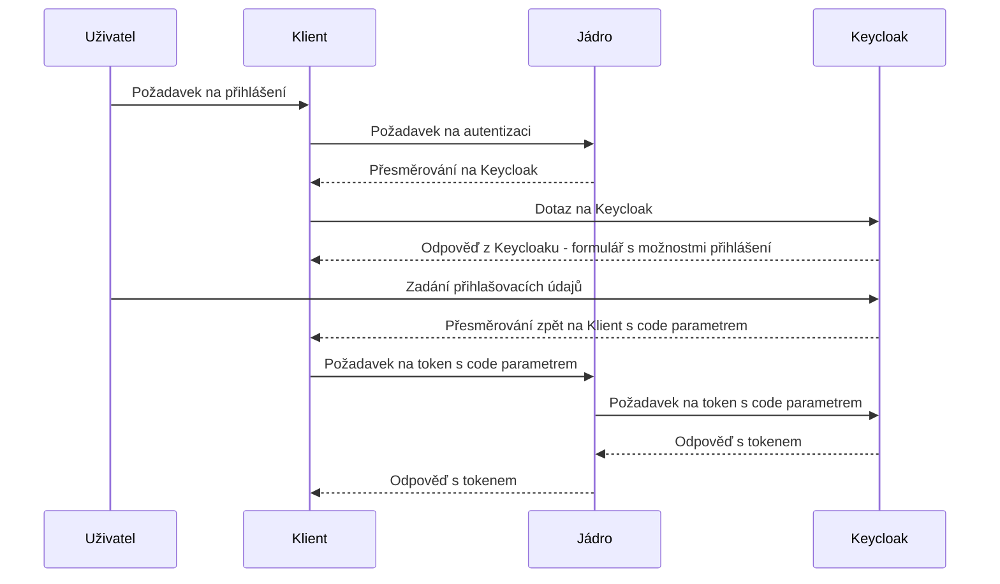

## Bezpečnost, autentizace a autorizace

Autorizace a autenizace je realizována pomocí protokolu Oauth2. Klient/browser, který se chce autentizovat nejdříve pošle request na jádro krameria na endpoint `~/search/api/client/v7.0/user/login`. Ten ho přesměruje na aktuální keycloak, kde se uživatel autentizuje jedním s podporovaných typů přihlášení (formulář, shibboleth federace,  facebook, google, atd..), následně je přesměrován na konfigurovanou adresu s parametrem `code`. Pomocí parametru je klient/browser schopen získat `access token`.  Poté `access token` používá ve všech voláních na jádro. 

Diagram získání JWT tokenu:

<!--
* Okdkaz na práva - práva v K7
* Sekvence diagram přístupu k tokenu
* Keycloak - nastavení a přístupy
* EDuid federace 
* DNNT 
-->