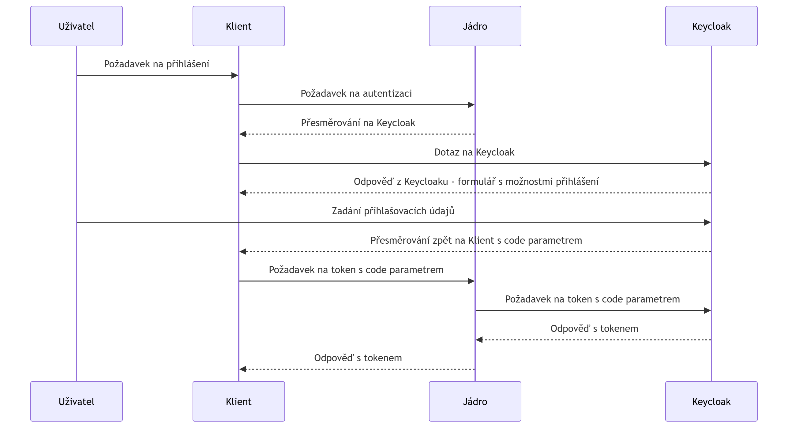

[Index](../../index.md) / [Architektura](../../architecture/index.md)  / [Zabezpečení](../../architecture/security/index.md)

# Autentizace

Autentizace v Krameriovi je založena na standardech OAuth 2.0 a OpenID Connect.

Ověření identity probíhá mimo Kramerius v externím Identity Provideru.

## Tok autentizace

```text
User
  |
  | Login
  v
Keycloak
  |
  | JWT Token
  v
Kramerius
```

Po úspěšném přihlášení získá klient přístupový token.

Token je následně přikládán ke každému požadavku na API.
Autorizace a autenizace je realizována pomocí protokolu Oauth2. Klient/browser, který se chce autentizovat nejdříve pošle request na jádro krameria na endpoint `~/search/api/client/v7.0/user/login`. Ten ho přesměruje na aktuální keycloak, kde se uživatel autentizuje jedním s podporovaných typů přihlášení (formulář, shibboleth federace,  facebook, google, atd..), následně je přesměrován na konfigurovanou adresu s parametrem `code`. Pomocí parametru je klient/browser schopen získat `access token`.  Poté `access token` používá ve všech voláních na jádro.

Každý požadavek na Kramerius API může obsahovat **JWT token** (JSON Web Token). Pokud požadavek token obsahuje, jádro Krameria předpokládá, že uživatel je přihlášen, a provádí autorizaci na základě uživatelské role, která je definována v tokenu. Jádro dokáže token dekódovat, zjistit role a atributy uživatele a na základě toho přiřadit práva k požadovaným akcím.

Celý proces autentizace a autorizace je založen na protokolu **OAuth2**. Získání tokenu probíhá následujícím způsobem:

1. **Přihlášení uživatele**: Klient nebo webový prohlížeč, který se chce autentizovat, odešle požadavek na endpoint jádra Krameria `~/search/api/client/v7.0/user/login`.
2. **Přesměrování na Keycloak**: Uživatel je přesměrován na server **Keycloak**, který zajišťuje autentizaci. Zde se uživatel přihlásí jedním z podporovaných způsobů (formulář, Shibboleth federace, Facebook, Google, atd.).
3. **Získání přístupového kódu (code)**: Po úspěšné autentizaci je uživatel přesměrován zpět na konfigurovanou URL s parametrem `code`.
4. **Získání access tokenu**: Klient nebo prohlížeč pomocí obdrženého kódu získá **access token**.
5. **Použití access tokenu**: Tento **access token** je pak použit ve všech dalších voláních na API jádra Krameria.

Jádro Krameria je připojeno na server Keycloak, který zajišťuje ověřování tokenů. Jádro token dekóduje, získává informace o rolích a atributech uživatele a na základě nich rozhoduje o přístupových právech k jednotlivým operacím.


Diagram získání JWT tokenu:




## Zpracování tokenu

Při příjmu požadavku Kramerius:

1. získá token z HTTP požadavku,
2. ověří jeho platnost,
3. ověří podpis,
4. načte identitu uživatele,
5. načte role.

## Výsledek autentizace

Po úspěšné autentizaci jsou dostupné:

- identifikátor uživatele,
- uživatelské jméno,
- role,
- další atributy předané poskytovatelem identity.

Tyto informace jsou následně použity při autorizaci.

## Navazujici dokumentace

- ➡️ [Reference](../../reference/security/authentication/index.md)
