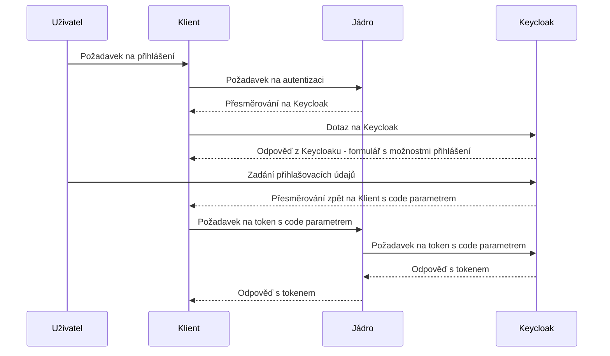

[Index](../../index) / [Architektura](../../architecture)  / [Zabezpečení](../../architecture/security)

# Autentizace

Autentizace v Krameriovi je založena na standardech OAuth 2.0 a OpenID Connect.

Ověření identity probíhá mimo Kramerius v externím Identity Provideru.

## Tok autentizace

```text
User
  |
  | Login
  v
Keycloak
  |
  | JWT Token
  v
Kramerius
```

Po úspěšném přihlášení získá klient přístupový token.

Token je následně přikládán ke každému požadavku na API.
Autorizace a autenizace je realizována pomocí protokolu Oauth2. Klient/browser, který se chce autentizovat nejdříve pošle request na jádro krameria na endpoint `~/search/api/client/v7.0/user/login`. Ten ho přesměruje na aktuální keycloak, kde se uživatel autentizuje jedním s podporovaných typů přihlášení (formulář, shibboleth federace,  facebook, google, atd..), následně je přesměrován na konfigurovanou adresu s parametrem `code`. Pomocí parametru je klient/browser schopen získat `access token`.  Poté `access token` používá ve všech voláních na jádro.

Diagram získání JWT tokenu:



## Zpracování tokenu

Při příjmu požadavku Kramerius:

1. získá token z HTTP požadavku,
2. ověří jeho platnost,
3. ověří podpis,
4. načte identitu uživatele,
5. načte role.

## Výsledek autentizace

Po úspěšné autentizaci jsou dostupné:

- identifikátor uživatele,
- uživatelské jméno,
- role,
- další atributy předané poskytovatelem identity.

Tyto informace jsou následně použity při autorizaci.

## Navazujici dokumentace

- ➡️ [Reference](../../reference/security/authentication)
