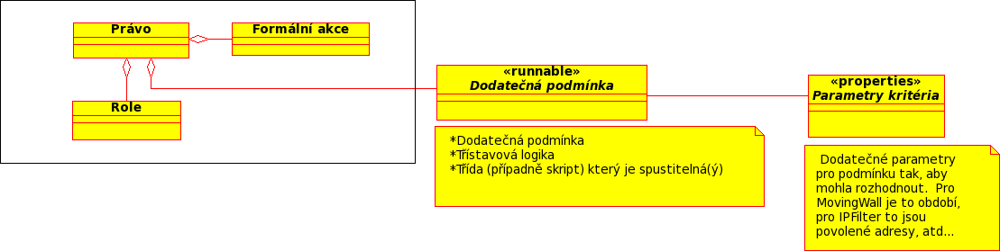

# Autorizace

Autorizace rozhoduje, zda může uživatel provést požadovanou operaci.

Na rozdíl od autentizace probíhá autorizace přímo v Krameriovi.

## Autorizační model

```text
User
  ↓
Roles
  ↓
Actions
  ↓
Criteria
  ↓
Decision
```



## Vyhodnocení požadavku

Při každém chráněném požadavku probíhá následující proces:

```text
Request
   ↓
Authentication
   ↓
Roles
   ↓
Actions
   ↓
Criteria
   ↓
Permit / Deny
```

### Krok 1 – Získání rolí

Role jsou převzaty z autentizačního tokenu.

### Krok 2 – Vyhodnocení akcí

Role jsou namapovány na akce definované v Krameriovi.

Například:

```text
ROLE_ADMIN
    ↓
ADMIN_ACCESS
```

### Krok 3 – Vyhodnocení kritérií

Pokud jsou k akci přiřazena kritéria, musí být všechna splněna.

Například:

```text
VIEW_DOCUMENT
     ↓
Allowed IP Range
```

### Krok 4 – Rozhodnutí

Pokud jsou splněny všechny požadavky:

```text
Permit
```

jinak:

```text
Deny
```

## Rozšířitelnost

Autorizační model je navržen tak, aby bylo možné přidávat nové typy kritérií bez změny existujících rolí nebo akcí.

## Související kapitoly

- [Vyhodnoceni podminek](criteria-evaluation)
- [mapovani rolo](role-mapping)
- [Reference / Authorization](../../../reference/security/authorization/)
- [Reference / Criteria](../../../reference/security/criteria/)