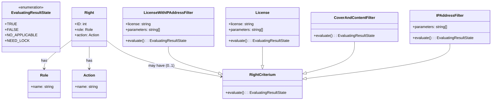

[Index](../../index) / [Architektura](../../architecture)  / [Zabezpečení](../../architecture/security)

## Práva

Koncept práv. Všechny informace o právech, licencích, dodatečných podmínkách jsou ukládány v servisní databázi Postgres SQL a situaci nejlépe vystihuje následující diagram:

Právo reprezentováno vazbou mezi rolí a akcí, kterou se uživatel snaží vykonat. V tomto jednoduchém případě vždy platí, že uživatel má právo vykonat danou akci.  Vazba může být rozšířena o dodatečnou podmínky, ta pak dál specifikuje podmínky za kterých uživatel může danou akci vykonat. 

## Chráněné akce

* **A_READ**  
  Má právo číst konkrétní objekt. Jedná se o klíčovou akci v systému, která rozhoduje, zda má uživatel povolení číst daný dokument nebo jeho jednotlivé stránky.

* **A_PDF_READ**  
  Akce uděluje uživateli právo přistupovat k PDF zdrojům. Pokud není povolena, přístup k PDF endpointům je zcela zakázán. I když je akce povolena, nemusí to znamenat, že uživatel získá přístup ke skutečným skenům dokumentu. Pokud nemá právo číst daný dokument, místo skenů se v PDF zobrazí hláška o nedostupnosti. Tato akce je standardně povolena pro všechny uživatele.

* **A_DELETE**  
  Akce reprezentuje možnost mazat konkrétní objekt/pid.
atd.

## Role v systému

Každý přihlášený uživatel má přiřazenou jednu nebo více rolí. Ve výchozím nastavení jsou v Krameriovi k dispozici tyto dvě role:

- **kramerius_admin**  
  Administrátorská role, která opravňuje k provádění všech administrátorských úkonů a správě uživatelských oprávnění.

- **common_users**  
  Role pro všechny běžné uživatele, která zajišťuje základní přístupová oprávnění.

- **dnnt_users**  
  Role určená pro uživatele, kteří mají přístup k dnnto dokumentům

