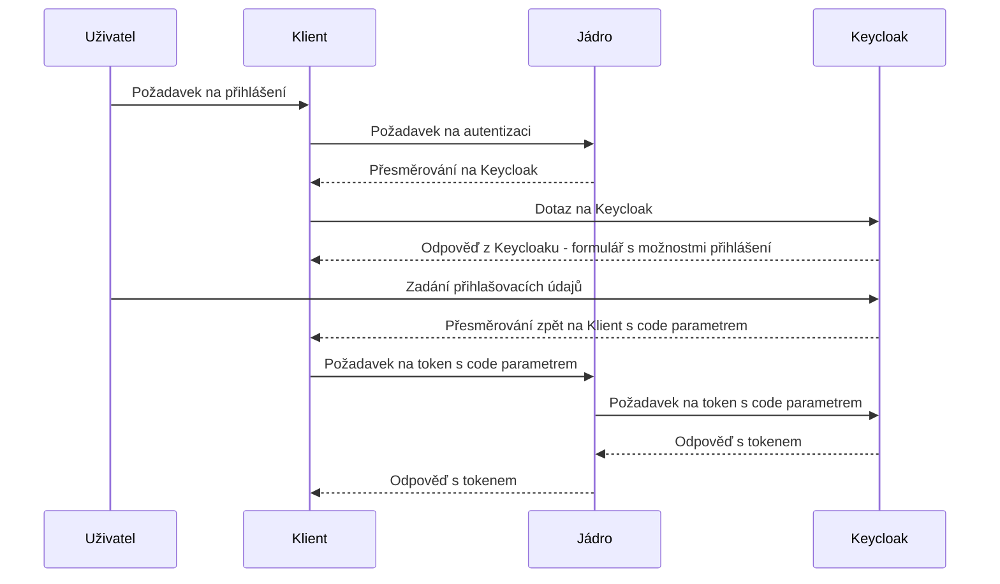

```mermaid
sequenceDiagram
    participant Uživatel
    participant Klient
    participant Jádro
    participant Keycloak

    Uživatel->>Klient: Požadavek na přihlášení
    Klient->>Jádro: Požadavek na autentizaci
    Jádro-->>Klient: Přesměrování na Keycloak
    Klient->>Keycloak: Dotaz na Keycloak
    Keycloak-->>Klient: Odpověď z Keycloaku - formulář s možnostmi přihlášení
    Uživatel->>Keycloak: Zadání přihlašovacích údajů
    Keycloak-->>Klient: Přesměrování zpět na Klient s code parametrem
    Klient->>Jádro: Požadavek na token s code parametrem
    Jádro->>Keycloak: Požadavek na token s code parametrem
    Keycloak-->>Jádro: Odpověď s tokenem
    Jádro-->>Klient: Odpověď s tokenem
```
