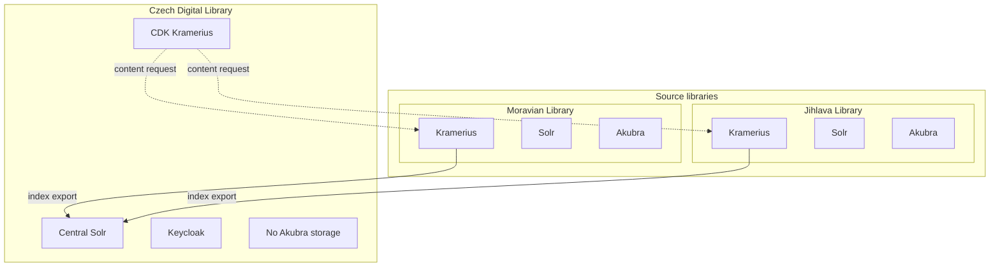

```mermaid
flowchart TB

    subgraph SourceLibraries["Source libraries"]

        subgraph MZK["Moravian Library"]
            MZK_K[Kramerius]
            MZK_S[Solr]
            MZK_A[Akubra]
        end

        subgraph JIHLAVA["Jihlava Library"]
            J_K[Kramerius]
            J_S[Solr]
            J_A[Akubra]
        end
    end

    subgraph CDK["Czech Digital Library"]

        C_K[CDK Kramerius]
        C_S[Central Solr]
        C_KC[Keycloak]

        NOTE["No Akubra storage"]
    end

    MZK_K -->|index export| C_S
    J_K -->|index export| C_S

    C_K -. content request .-> MZK_K
    C_K -. content request .-> J_K
```
