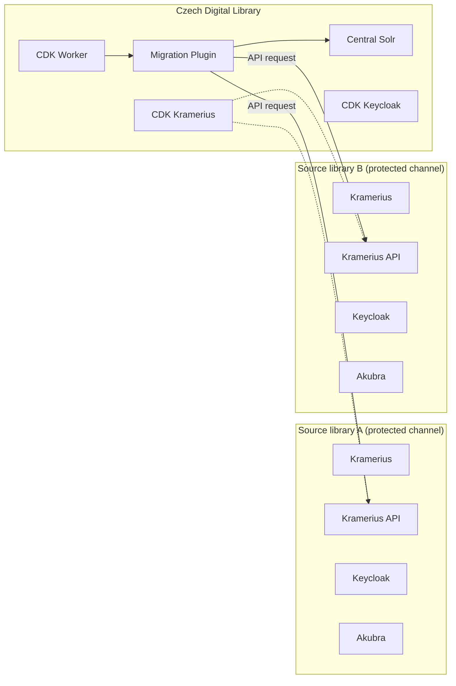

```mermaid
flowchart LR

    subgraph LIB1["Source library A (protected channel)"]
        K1[Kramerius]
        API1[Kramerius API]
        KC1[Keycloak]
        AK1[Akubra]
    end

    subgraph LIB2["Source library B (protected channel)"]
        K2[Kramerius]
        API2[Kramerius API]
        KC2[Keycloak]
        AK2[Akubra]
    end

    subgraph CDK["Czech Digital Library"]
        W[CDK Worker]
        MIG[Migration Plugin]
        CK[CDK Kramerius]
        SOLR[Central Solr]
        AUTH[CDK Keycloak]
    end

    W --> MIG

    MIG -->|API request| API1
    MIG -->|API request| API2

    MIG --> SOLR

    CK -.-> API1
    CK -.-> API2
```