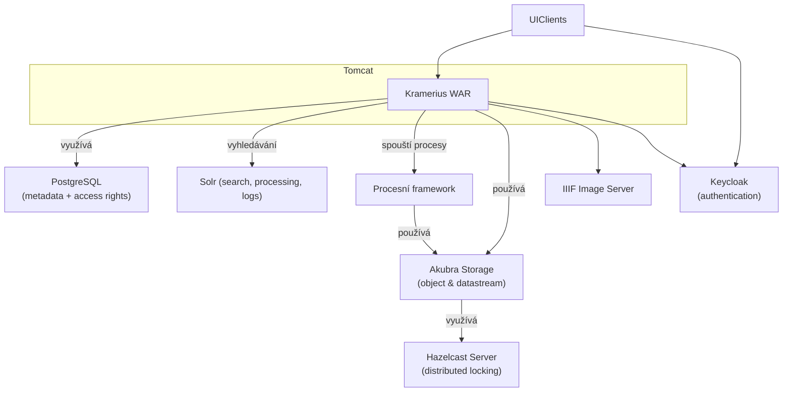

# Core

```mermaid
flowchart TB
  subgraph Tomcat
    KrameriusWAR["Kramerius Core (Tomcat)"]
  end

  KrameriusWAR -->|využívá| PostgreSQL["PostgreSQL\n(metadata + access rights)"]
  KrameriusWAR -->|vyhledávání| Solr["Solr (search, processing, logs)"]
  KrameriusWAR -->|spouští procesy| ProcPlatform["Procesní framework"]
  ProcPlatform -->|používá| Akubra["Akubra Storage\n(object & datastream)"]
  KrameriusWAR -->|používá| Akubra
  Akubra -->|využívá| Hazelcast["Hazelcast Server\n(distributed locking)"]
  KrameriusWAR --> IIIF["IIIF Image Server"]
  KrameriusWAR --> Keycloak["Keycloak\n(authentication)"]
  UIClients --> KrameriusWAR["Kramerius WAR"]
  UIClients --> Keycloak["Keycloak\n(authentication)"]
```
