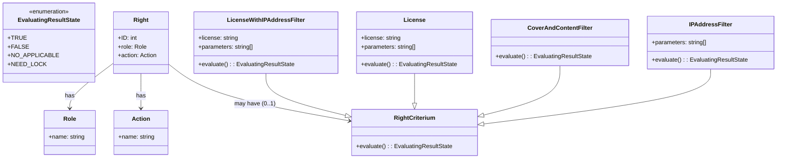

```mermaid
classDiagram

    class RightCriterium {
        +evaluate(): EvaluatingResultState
    }

    class EvaluatingResultState {
        <<enumeration>>
        +TRUE
        +FALSE
        +NO_APPLICABLE
        +NEED_LOCK
    }

    class Right {
        +ID: int
        +role: Role
        +action: Action
    }

    class Role {
        +name: string
    }

    class Action {
        +name: string
    }

    class IPAddressFilter {
        +parameters: string[]
        +evaluate(): EvaluatingResultState
    }

    class CoverAndContentFilter {
        +evaluate(): EvaluatingResultState
    }

    class License {
        +license: string
        +parameters: string[]
        +evaluate(): EvaluatingResultState
    }

    class LicenseWithIPAddressFilter {
        +license: string
        +parameters: string[]
        +evaluate(): EvaluatingResultState
    }

    %% Inheritance relationships
    IPAddressFilter --|> RightCriterium
    CoverAndContentFilter --|> RightCriterium
    License --|> RightCriterium
    LicenseWithIPAddressFilter --|> RightCriterium

    %% Relationships
    Right --> Role : has
    Right --> Action : has
    Right --> RightCriterium : may have (0..1)

```
