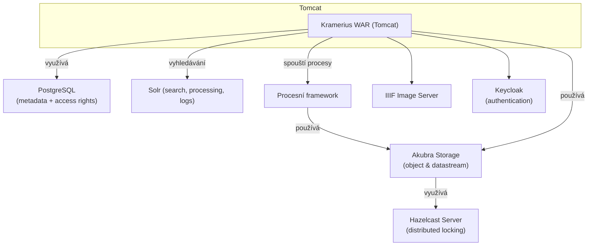

# Diagram

Kramerius jadro je dodáván jako **WAR soubor**, který běží v aplikačním serveru **Tomcat**. Aplikace využívá několik externích a interních modulů pro správu dat, vyhledávání, autentizaci a orchestrace procesů.

