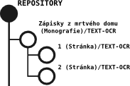

# Datastreamy

Kromě metadat obsahují objekty také datastreamy.

Datastream představuje konkrétní uložená data připojená k objektu.

Typickými příklady jsou:

- bibliografická metadata
- technická metadata
- OCR text
- obrazová data
- zvukové soubory

