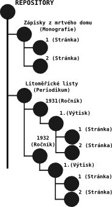

# Digitální objekt

Základní jednotkou systému je digitální objekt.

Digitální objekt může představovat například:

- knihu
- periodikum
- číslo periodika
- stránku
- obrázek
- zvukový dokument
- jiný digitalizovaný materiál

Objekty jsou organizovány do hierarchických struktur a tvoří logický model dokumentu.

