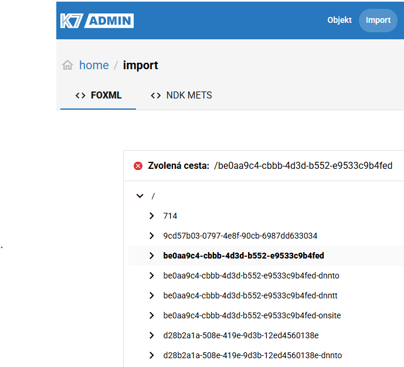
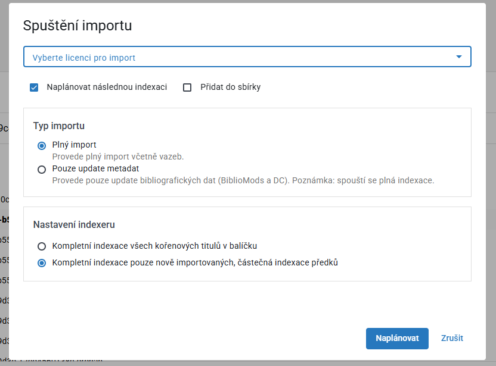

# 📥 Spuštění importu

Import načítá digitální data z importního adresáře Krameria.

## Předpoklady

- máte roli kurátora
- data jsou dostupná v importním adresáři (dle konfigurace Krameria)

---

## Postup

1. Otevřete **Admin klienta**
2. Přejděte do sekce **Import**
3. Zobrazí se seznam importních balíčků:
    - tab **FOXML**
    - tab **NDK METS**
4. Rozklikněte požadovaný balíček (root dokument podle PID)

   

    - zobrazí se seznam XML souborů (stránky / části dokumentu)
    - každá položka je identifikována PIDem

---

## Spuštění importu

1. Klikněte na **Spustit import**
2. Otevře se dialog nastavení importu

   

---

### Licence
Vyberte licenci, která bude přiřazena importovaným dokumentům.

---

### Volby importu

- ☑ Naplánovat následnou indexaci
- ☑ Přidat do sbírky

---

### Typ importu

- **Plný import**
    - provede kompletní import včetně vazeb

- **Pouze update metadat**
    - aktualizuje pouze bibliografická metadata (BiblioMods / DC)
    - spustí plnou indexaci

---

### Nastavení indexeru

- Kompletní indexace všech kořenových titulů
- Částečná indexace pouze nových dokumentů

---

3. Klikněte na **Naplánovat**

---

## Co se stane po spuštění

- import je zařazen do fronty procesů
- běží asynchronně
- lze sledovat v sekci procesů

➡️ [Sledování procesů](../../tasks/processes/view-process.md)

---

## Související

- [Troubleshooting importu](../../troubleshooting/import-failed.md)
- [Procesy v systému](../../reference/processes.md)