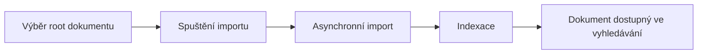

# 📦 Zpracování nové dávky (Import + indexace)

Tento workflow popisuje kompletní zpracování nové digitální dávky od jejího importu až po indexaci v systému Kramerius.

Workflow se skládá ze dvou navazujících kroků:

1. Import dat
2. Indexace dat

Oba kroky jsou spouštěny v Admin klientu a běží asynchronně.

---

## Přehled procesu

---

## 1. Import

Import je vstupní krok, který načte data z importního adresáře definovaného v konfiguraci systému.

➡️ [Spustit import](../tasks/import/start-import)

---

## 2. Indexace

Po úspěšném importu následuje indexace dat do vyhledávacího systému.

➡️ [Spustit indexaci](../tasks/indexing/start-indexing)

---

## Jak poznám, že workflow proběhlo správně?

- importní proces skončí bez chyby
- indexace dokončena
- dokument je dostupný ve vyhledávání

---

## Co dělat při problému

- import selhal → viz Troubleshooting
- indexace neběží → viz Troubleshooting
- dokument se nezobrazuje → viz Troubleshooting

➡️ [Řešení problémů](../troubleshooting/index)

---

## Související dokumentace

- [Import proces (reference)](../../reference/process/import)
- [Indexace proces (reference)](../../reference/process/indexing)
- [Konfigurace importního adresáře](../../configuration/import)