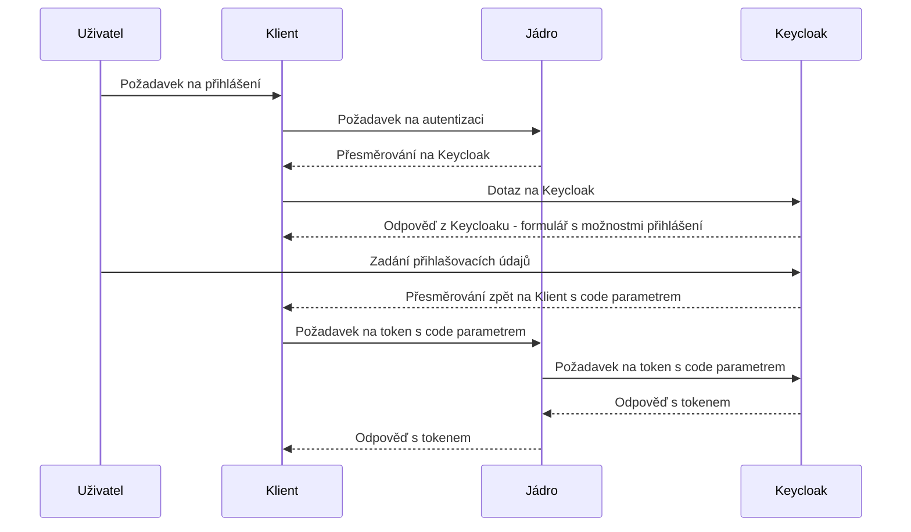

[Index](../index) / [Reference](..)

# Dokumentace Kramerius REST API

#### Popis platný k verzi 7.0.38 a vyšší.

Kramerius je systém pro správu digitálních knihoven, který poskytuje komplexní řešení pro přístup, vyhledávání a správu digitálních dokumentů. Systém Kramerius je široce využíván na různých místech, kde umožňuje přístup k digitalizovaným knihovním zdrojům pomocí REST API.

Toto REST API je standardně dostupné na nainstalovaném serveru pod kontextem: `~/search/api/*` a je formálně rozděleno na tři části:

- **Klientská část**: Umožňuje uživatelům přistupovat k dostupným zdrojům knihovny.
- **Administrační část**: Slouží pro správu a údržbu systému.
- **API pro externí aplikace**: Endpointy pro podporu externích aplikací 


API je rozděleno do modulů pro jednodušší integraci a údržbu. Klientské části API jsou zdokumentovány pomocí **OpenAPI** a je přístupná v každé instanci K7.

**Živá dokumentace** je dostupná na serveru pod kontextem: `<server>/search/openapi/index.html`. Tato dokumentace využívá rozhraní **Swagger UI**, kde je možné jednotlivé dotazy přímo vyzkoušet a rovněž podporuje přihlášení pro práci s chráněnými API funkcemi.

[Úvod](#1-úvod)<br>
[Pravidla pro všechny typy volání](#2-pravidla-pro-všechny-typy-volání)<br>
[Kramerius REST API](#3-kramerius-rest-api)<br>

---

## 1. Úvod

Kramerius REST API poskytuje přístup k digitalizovaným zdrojům knihovny. Pomocí tohoto API mohou klientské aplikace provádět různé operace, jako je vyhledávání, přístup ke konkrétnímu obsahu a 
správa sbírek, výstřížků, administrační část poskytuje pak plnou podporu pro plnou administraci. 

---

## 2. Pravidla pro všechny typy volání

### 2.1 Formát požadavků a odpovědí

- **Struktura žádostí**: Všechny žádosti by měly být odesílány ve formátu JSON s příslušnými HTTP metodami (např. GET, POST, PUT, DELETE). Je důležité používat odpovídající hlavičky HTTP (např. `Content-Type: application/json`).

- **Odpovědi**: Standardně vrací Kramerius API odpovědi ve formátu JSON. Výjimky se vyskytují u případů, kdy jsou zdrojová data uložena v jiných formátech. Mezi tyto výjimky patří:
  - **Metadata ve formátu XML**: Některé druhy metadat, jako **Dublin Core (DC)** nebo **Biblio MODS**, jsou vraceny ve formátu XML.
  - **ALTO**: Odpovědi obsahující strukturovaná metadata o stránkách a jejich uspořádání jsou vraceny ve formátu XML.
  - **OCR text**: Výsledky optického rozpoznávání znaků (OCR) jsou vraceny ve formátu **text/plain**.
  - **Solr odpovědi**: Při použití parametru `wt=xml` v dotazech na Solr API jsou odpovědi vráceny ve formátu XML.

V těchto případech je třeba zpracovat XML či textové odpovědi podle struktury odpovídající specifikacím konkrétních formátů.

### 2.2 Zpracování chyb

- Kramerius REST API používá standardní HTTP status kódy k indikaci úspěšnosti nebo selhání požadavku:
  - **200 OK**: Požadavek byl úspěšně zpracován.
  - **400 Bad Request**: Špatný formát požadavku nebo neplatné parametry.
  - **401 Unauthorized**: Neoprávněný přístup k chráněným zdrojům.
  - **403 Forbidden**: Přístup k požadovanému zdroji je zakázán.
  - **404 Not Found**: Požadovaný zdroj nebyl nalezen.
  - **500 Internal Server Error**: Interní chyba serveru.

V případě chyby API vrací chybové odpovědi ve formátu JSON.

 
 ### 2.3 Bezpečnost  - OAUTH2

Každý požadavek na Kramerius API může obsahovat **JWT token** (JSON Web Token). Pokud požadavek token obsahuje, jádro Krameria předpokládá, že uživatel je přihlášen, a provádí autorizaci na základě uživatelské role, která je definována v tokenu. Jádro dokáže token dekódovat, zjistit role a atributy uživatele a na základě toho přiřadit práva k požadovaným akcím.

Celý proces autentizace a autorizace je založen na protokolu **OAuth2**. Získání tokenu probíhá následujícím způsobem:

1. **Přihlášení uživatele**: Klient nebo webový prohlížeč, který se chce autentizovat, odešle požadavek na endpoint jádra Krameria `~/search/api/client/v7.0/user/login`.
2. **Přesměrování na Keycloak**: Uživatel je přesměrován na server **Keycloak**, který zajišťuje autentizaci. Zde se uživatel přihlásí jedním z podporovaných způsobů (formulář, Shibboleth federace, Facebook, Google, atd.).
3. **Získání přístupového kódu (code)**: Po úspěšné autentizaci je uživatel přesměrován zpět na konfigurovanou URL s parametrem `code`.
4. **Získání access tokenu**: Klient nebo prohlížeč pomocí obdrženého kódu získá **access token**.
5. **Použití access tokenu**: Tento **access token** je pak použit ve všech dalších voláních na API jádra Krameria.

Jádro Krameria je připojeno na server Keycloak, který zajišťuje ověřování tokenů. Jádro token dekóduje, získává informace o rolích a atributech uživatele a na základě nich rozhoduje o přístupových právech k jednotlivým operacím.

#### Diagram získání JWT tokenu:



---
# 3. Kramerius REST API

### 3.1 Klientská část
Swagger dokumentace dostupných endpointů je k dispozici [zde](https://k7.inovatika.dev/search/openapi/client/v7.0/index.html). 


### 3.2 Administrační část
Swagger dokumentace dostupných endpointů je k dispozici [zde](https://k7.inovatika.dev/search/openapi/admin/v7.0/index.html). 


### 3.3 Externí část
Swagger dokumentace dostupných endpointů je k dispozici [zde](https://k7.inovatika.dev/search/openapi/exts/v7.0/index.html).

### 3.4 OAI PMH
popis je k dispozici [zde](oai-pmh-protocol).

---
# 4. Monitoring pomalých dotazů

Od verze **7.0.40** je možno monitorovat dotazy, u kterých je delší doba odpovědi než je definovaná hodnota threshold. Jednotlivé události jsou ukládány v solr jádře [monitor](https://github.com/ceskaexpedice/kramerius/tree/master/installation/solr-9.x/monitor).  Konfigurační parametry jsou:

TODO presunout do kapitoly Konfigurace

```properties
# Threshold in milliseconds for monitoring events.
# Events with duration above this value will be recorded.
api.monitor.threshold = 1000

# Endpoint for recording monitoring events.
# 'monitor' is the Solr core where events are stored.
api.monitor.point=http://localhost:8983/solr/monitor

# Label to be included with each monitoring event.
# This allows distinguishing between different instances of Kramerius 
# (e.g., in a cloud or clustered environment where each node has a unique name).
labels=Instance_name
```

V admin prostředí jsou tyto dotazy vidět na cestě `home/sledování API`. Viz screenshot: 


## Navazujici dokumentace

- ➡️ [Zakladni pojmy](../../core-concepts/api/)
- ➡️ [Verzovani](../../versioning/)


