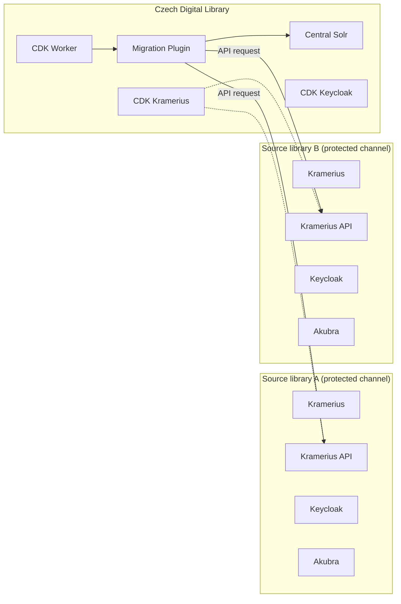
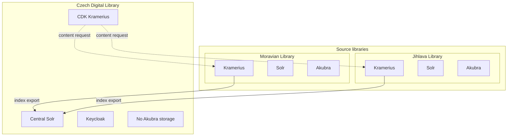

# Česká digitální knihovna (CDK)

## Overview

Česká digitální knihovna (CDK) je centrální agregační vrstva nad více nezávislými instancemi systému Kramerius.

Každá knihovna (např. regionální nebo institucionální) provozuje vlastní instanci Krameria, která obsahuje:

- aplikační jádro Kramerius
- Apache Solr index
- Keycloak pro autentizaci
- Akubra repository pro ukládání digitálních objektů

CDK tyto knihovny sjednocuje do jednoho vyhledávacího a přístupového systému.

---

## Architecture

CDK je samostatná instance Krameria a obsahuje:

- CDK Kramerius runtime
- CDK Worker (orchestrace procesů)
- Migration plugin (asynchronní indexační proces)
- Central Solr index
- Keycloak (CDK autentizační vrstva)

Na rozdíl od zdrojových knihoven CDK **neobsahuje vlastní Akubra repository**.

---

## Source libraries

Každá zdrojová knihovna je nezávislá instance Krameria.

Tyto knihovny jsou do CDK připojeny jako **chráněné kanály (protected channels)**.

---

## Protected channel model

Přístup mezi CDK a zdrojovou knihovnou je řízen pomocí API autentizace:

1. Zdrojová knihovna při inicializaci vygeneruje **API klíč**
2. Tento API klíč je nakonfigurován v CDK na úrovni konfigurace zdrojů
3. CDK používá tento klíč pro:
    - Migration procesy
    - runtime načítání digitálního obsahu

API komunikace probíhá přes standardizované Kramerius API vrstvu.

---

## Aggregation model (Migration)

Indexace obsahu probíhá pomocí Migration procesu:

- Migration plugin běží v CDK
- je spouštěn asynchronně CDK Workerem
- připojuje se ke zdrojovým knihovnám přes API
- používá API klíč pro autentizovaný přístup

Proces je opakovaný (incremental sync), aby zachytil změny ve zdrojových knihovnách.

Výsledkem je centrální Solr index obsahující metadata všech knihoven.

---

## Content access

CDK neuchovává digitální obsah (stránky, obrazy, PDF).

Při otevření dokumentu:

1. CDK identifikuje zdrojovou knihovnu
2. přes API vrstvu (chráněný kanál) zavolá zdrojový Kramerius
3. použije API klíč pro autentizaci
4. načte požadovaný digitální obsah

Tento přístup umožňuje:

- centralizované vyhledávání
- decentralizované ukládání dat
- zabezpečený přístup přes API klíče

---

## High level architecture

## CDK aggregation model

## Benefits

- jednotné vyhledávání napříč knihovnami
- bezpečný federovaný přístup (API keys + protected channels)
- žádná duplikace digitálních dat
- nezávislost jednotlivých institucí
- oddělení indexace a storage vrstvy

---

## Related documentation

- reference/api – API vrstva Krameria
- reference/configuration – konfigurace zdrojových knihoven a CDK
- reference/processes/migration – indexační proces
- reference/cdk/architecture – detailní komponenty