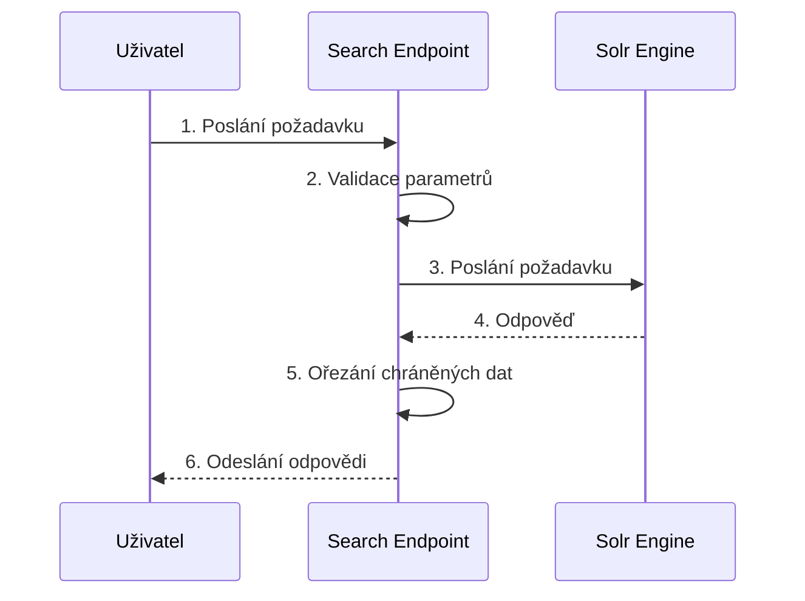

## Vyhledávání

Vyhledávání je umožněno endpointem, který slouží jako proxy do vyhledávacího enginu SOLR. Přebírá všechny parametry, validuje je a následně posílá na vyhledávací server solr. Z odpovědi jsou filtrována data typu TEXT_OCR a je posílán zpět na klienta. 





Příklad dotazu: 

```
GET ~/search/api/client/v7.0/search??q=model:monograph&rows=1&fl=pid+pid_paths+root.model+model+titles.search

```

Příklad odpovědi: 
```json
{
  "response": {
    "docs": [
      {
        "titles.search": [
          "Marná sláva: profesorské romanetto"
        ],
        "pid_paths": [
          "uuid:33244df3-e448-4a2c-b69f-3a0fb96fc8c7"
        ],
        "root.model": "monograph",
        "model": "monograph",
        "pid": "uuid:33244df3-e448-4a2c-b69f-3a0fb96fc8c7"
      }
    ],
    "numFound": 2,
    "start": 0,
    "numFoundExact": true
  },
  "responseHeader": {
    "QTime": 0,
    "params": {
      "q": "model:monograph",
      "fl": "pid pid_paths root.model model titles.search",
      "hl.fragsize": "20",
      "rows": "1",
      "wt": "json"
    },
    "status": 0
  }
}
```

Možné parametry jsou všechny, které akceptuje vyhledávací engine solr. Dokumentace je k nalezení [zde](https://solr.apache.org/guide/solr/latest/query-guide/query-syntax-and-parsers.html)

Popis jednotlivých indexovaných polí je k nalezení [zde](https://github.com/ceskaexpedice/kramerius/blob/master/installation/solr-9.x/search/conf/managed-schema).


