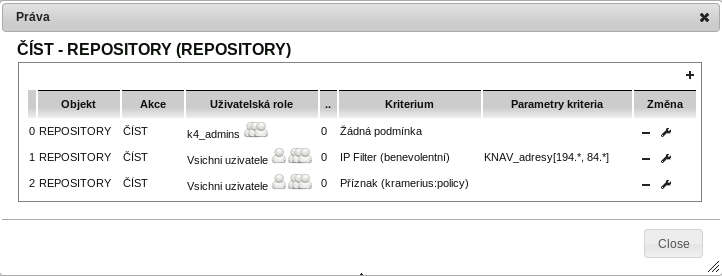
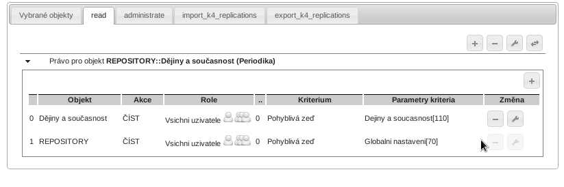
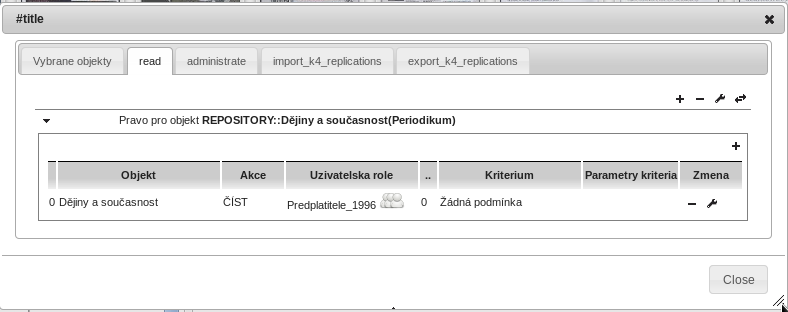
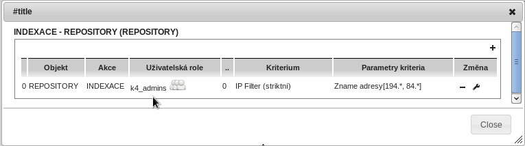

#Přístupová práva
[[_TOC_]]

# Úvod

Práva systému Kramerius 5  jsou na rozdíl od bibliografických dat ukládána v servisní
databázi postgres, ve stejném tabulkovém prostoru jako například tabulky pro správu
procesů. Datový model zobrazený formou UML diagramu tříd vypadá následovně:


Právo je v databázi vyjádřeno jako  vazba mezi rolí, akcí a
chráněným objektem. Vazba může být dál “obohacena” o dodatečnou podmínku a parametry dodatečné podmínky.

Pokud je vazba bez dodatečné podmínky lze to interpretovat následovně:

*Uživatel s danou rolí má právo provádět akci nad chráněným objektem.*

Pokud je zde ještě vazba na dodatečnou podmínku, lze to interpretovat jako:


*Uživatel s danou rolí má právo provádět akci nad chráněným objektem ale pouze za určitých podmínek.*

Dále popíšu jednotlivé aktéry vazby.


# Akce

Akce zde reprezentuje formálně zapsanou opraci, kterou uživatel provadí. Krameriem definované akce jsou následující:

- *read* - Akce čti definuje operaci číst data (obrázky). _Pokud má uživatel práva tuto akci provádět, objeví se mu  velký náhled, vygeneruje PDF nebo zobrazí deepZoom prohlížečka._
- *import* - [[Import dat|MenuAdministrace#import-dat]]
- *reindex* - [[Indexace|MenuAdministrace#indexace-dokumentů]].
- *convert* - [[Manuální import dokumentů ve formátu DTD Krameria 3|MenuAdministrace#manuální-import-dokumentů-ve-formátu-DTD-Krameria-3]]
- *replicationrights*
- *enumerator* - [[Určení titulů pro replikaci|MenuAdministrace#určení-titulů-pro-replikaci]]
- *replikator_periodicals* - [[Import dat|MenuAdministrace#import-dat]]
- *replikator_monographs* - [[Import dat|MenuAdministrace#import-dat]]
- *delete* - Akce definuje opraci mazání dat z repository nebo indexu. _Uživatel může  pomocí příslušné nabídky v kontextovém menu objekt smazat._
- *export* - Akce definuje spuštění statického exportu. _Uživatel může provádět statický export do PDF._
- *setprivate, setpublic* - Akce definuje opraci změna příznaku veřejnosti nebo neveřejnosti dokumentu.  _Uživatel může přes kontextové menu měnit příznak._
- *administrate* - Akce definuje opraci administraci práv k danému objektu. _Uživatel může měnit práva k danému objektu. Pokud je chráněný objekt celé repository objeví se příslušná položka v administrátorském menu v opačném případě se objeví položka pouze v menu kontextovém._
- *editor*  - Akce spouštět metadata editor. _Uživatel může spouštět metadata editor._
- *usersadmin*  - Akce spouštět editor uživatelů  v superadmin módu (viz dále). _Uživatel může přes administrátorské menu spouštět editor uživatelů._
- *userssubadmin* - Akce spouštět editor v subadmin modu (viz dále).  _Uživatel může přes administrátorské menu spouštět editor uživatelů._
- *manage_lr_process* - Akce spravovat dlouhotrvajíci procesy.  _Uživatel může přes administrátorské menu spravovat dlouhotrvající procesy._
- *export_k4_replications* - Akce replikace objektů z K4
- *import_k4_replications* - Akce import objektů objektů do  K4
- *edit_info_text* - Akce editace textu na úvodní stránce. _Uživatel  může editovat text na úvodní stránce._
- *virtualcollection_manage* - Akce správa virtuálních sbírek. _Uživatel může spravovat virtuální sbírky._
- *export_cdk_replications* - Export pro ČDK. _Umožňuje instanci ČDK přístup k FOXML souborům._
- *display_admin_menu* - Akce zobrazení menu určeného pro administrátory. _Uživateli se zobrazí menu určené pro administrátory._


# Uživatelské role

Každý přihlášený uživatel figuruje v jedné nebo více rolích. Vazby uživatele a role jsou definovány buď v [[editoru uživatelů|PravaUsers]] a nebo mapujícím [[souborem|Shibboleth#nastavení-aplikace]]. V případě uživatelů autentizujicích pomocí protokolu shibboleth.

Standardně K4 definuje následující role:

- *k4_admins* - Administrátorská role.  Standardně opravňuje ke všem administrátorským úkonům.
- *common_users* - Reprezentuje všechny uživatele.


# Chráněný objekt

Chráněný objekt reprezentuje entitu, na kterou je akce aplikována. Většinou se jedná o součást repositáře
fedory (Monografie, Periodikum, Ročník, Výtisk, Stránka...) případně se může jednat o celý repositář (objekt REPOSITORY).

### Dědičnost objektů

Jednotlivé objekty jsou spolu spojeny vazbami a vytváří strom. Systém práv respektuje dědičnost mezi objekty a právo, které je definované na vyšší úrovni, je platné i pro úrovně nižší. Interpretace jde vždy odspodu (od listů) až po vrchní objekt REPOSITORY.

Příklad hierarchie:


Tedy pro příklad, pokud má systém zkoumat zda má uživatel právo na čtení dat pro určitou stránku periodika, nejdřív zkoumá zda není právo nadefinováno přímo na stránce, pokud není (nebo je ale nemohlo rozhodnout), pak se přejde o úroveň výš a to opakuje dokud systém nerozhodne nebo neskončí na nejvyšším objektu.

## Virtuální sbírky
Od verze 5.3.5 je podporováno přidávání práv na úrovni virtuálních sbírek. V případě, že titul patří do virtuální sbírky (případně do více sbírek) je jeho strom obohacen o  patřičnou virtuální sbírku (či sbírky). Strom pak může vypdat následovně.


Popis administrace virtuálních sbírek [zde](https://github.com/ceskaexpedice/kramerius/wiki/K5_PravaGUI#administrace-pr%C3%A1v-pro-virtu%C3%A1ln%C3%AD-sb%C3%ADrky)

# Dodatečná podmínka a parametry podmínky

Dodatečná podmínka umožňuje rozhodovat na základě dalších dodatečných kritérií, které jsou známy
až  při běhu programu (IP adresa, metadata objektu atd..).  Podmínka
může být definována třídou nebo skriptem. Výsledek vyhodnocení podmínky může mít tři stavy *ANO*, *NE* a *NEVÍM*, kde
třetí stav nevím se aplikuje v případě, že dodatečná podmínka není schopna rozhodnout a ponechává
rozhodnutí na "vyšší instanci".

Parametry podmínky jsou další potřebné informace pro vyhodnocení pomdmínky. Parametry jsou uživatelsky
definované.

## Modelový příklad




Obrázek je pořízen z administrátorského rozhraní krameria. Jsou na něm vidět nadefinovaná práva
pro objekt REPOSITORY a akci ČÍST - read.

* První definice říká, že uživatelé role k4_admins mohou číst data z aplikace bez jakýchkoliv dalších podmínek.
* Druhá definice zaručuje právo čtení pro uživatele přicházející z adres 194.XXX.XXX.XXX nebo 84.XXX.XXX.XXX. Jedná se o tzv. benevolentní filtr. Ten nerozhoduje záporně pouze rohodne stavem NEVIM, čímž předá řízení dalšímu pravidlu v pořadí.
* Poslední pravidlo rozhoduje na základě metadat. Pokud má dotazovaný objekt v metadatech řečeno, že je veřejný, povolí jeho zobrazení.  V opačném případě zobrazení dokumentu zakáže.


## Krameriem definované dodatečné podmínky

- *Příznak kramerius:policy* - Podmínka rozhodne stavy ANO nebo NE. Zkoumá metadata dotazovaného objektu a rozhoduje se podle příznaku kramerius:policy. Pokud obsahuje literal policy:private, pak se jedná o neveřejný dokument, v opačném případě o veřejný.
- *IP Filter benevolentní* - Benevolentní filter rozhodne stavy ANO nebo NEVIM. Zkoumá IP adresy návštěvníků. Jako parametry očekává regulární výrazy oddělěné středníkem. Pokud některá z IP adres vyhovuje některému z patternů zapsaném v parametrech práva,  vrací stav ANO, v opačném případě vrací stav NEVIM.
- *IP Filter skriktní*  - Podmínka má stejnou logiku jako ta předchozí  s tím, že rozhodováné stavy ANO nebo NE. Buď povolí přístup nebo zakáže.
- *Domain Filter benevolentní* - Filtr rozhodne stavy ANO nebo NEVIM. Pracuje podobně jako IP filter benevolentní s tím, že místo IP adres operuje s doménou získanou z DNS.
- *Domain Filter skriktní*  - Domain varianta sktritního filtru.
- *Pohyblivá zeď* - Podmínka rozhodne stavy ANO nebo NE. Zkoumá metadata dotazovaného objektu a nadřazených objektů. Jako parametr podmínka očekává počet let, po kterých musí být objekt chráněný. Z metadat vyčte rok vydání a porovná ho s vypočítaným datem (nyní - počet let z paremetru podmínky). **Pozn.: Jedná se o dynamické pravidlo které se vyhodnocuje v rámci běhového prostředí. Neaplikuje se při vyhledávání a pokud uživatel chce toto pravidlo použít pro zobrazení veřejně dostupných dokumentů doporučujeme následující postup. [[Veřejně přístupné dokumenty|verejne_dokumenty]]**
- *Model's filter benevolentní* - Rozhoduje stavem ANO a NEVIM. Pokud je v parametrech kritéria uveden model objektu na který se uživatel dotazuje, či model některého z nadřazených objektů, rozhodne stavem ANO. V opačném případě rozhodne staven NEVIM.
- *Model's filter, negace - benevolentní* - Negace předchozího filtru. Rozhoduje stavem ANO a NEVIM. Pokud je v parametrech kritéria uveden model objektu na který se uživatel dotazuje, či model některého z nadřazených objektů, rozhodne stavem NEVIM. V opačném případě rozhodne stavem ANO.

- *Filtr obálek a obsahů - benevolentní* - Zkoumá BIBLIO_MODS dotazované stránky a zjišťuje, zda stránka není typu: "FrontCover", "TableOfContents", "FrontJacket", "TitlePage", "jacket". Rozhoduje stavem ANO a NEVIM. Pokud je stránka požadovaného typu, rozhoduje stavem ANO v opačném případě rozhoduje stavem NEVIM.

- *DNNT Flag* - Příznak DNNT. Slouží pro zapezpečení titulu, který má být zpřístupněn v režimu DNNT. Pravidlo mělo by být kombinováno s konkrétní rolí.
- *DNNT Flag combined with IP Filter* - Příznak DNNT s IP filtrem.
- *PDF DNNT Flag for securing pdf resource* - Příznak umožňuje zakázat tisk a generování PDF pro díla, která byla poskytnuta v DNNT.

- *DNNT Label* - Kontroluje label. Zúžení pravidla dnnt. Uživatel musí mít právo na konkretní label.
- *DNNT Label combined with IP filter* - Kontroluje label a IP adresu.  Uživatel musí mít právo na konkretní label a zároveň musí přicházet z konkrétní ip adresy

- *PDF DNNT Labels for securing pdf resource* - Příznak umožňuje zakázat tisk a generování PDF pro díla, která byla poskytnuta pod určitým labelem.


# Interpretace definovaných pravidel

Před rozhodováním, které pravidlo se uplatní, dochází nejdřív k jejich seřazení.  Poté se seřazená množina prochází a interpretuje.

Pořadí vykonávání si může administrátor zkontrolovat v dialogu práv. Zde platí, čím výš je pravidlo tím dřív se aplikuje.


# Řazení pravidel

Řazení pravidel se řídí dle následujících principů:

- Dle priority
- Dle síly kritéria
- Dle dědičnosti
- Dle času přidání


První se seřadí práva bez jakýchkoliv podmínek. Ta by se měla přidělovat konkrétním rolím a měla by znamenat, že daná role má právo na objekt bez jakýchkoliv výhrad.

Dále se řadí dle priority pokud je větší nebo rovna 1. Platí, že čím vyšší, tím víc prioritizované pravidlo. Pravidlo s prioriotou nula by mělo odpovídat pravidlu s nezadanou prioritou. Pokud budou mít dvě pravidla stejnou prioritu pak platí, ze výš je to dříve zadavané (řazení dle času přidání).


Následuje rozdělění dle úrovně kritéria. Kriteria jsou formálně rozdelena na úrovně MAX, NORMAL a MIN. Nejdříve se řadí kriteria v "přihrádce" MAX, poté NORMAL a nakonec MIN. V každé "příhrádce" se respektuje řazení dle dědičnosti (tzn. Pravidla blíž listu stromu má výšší váhu, směrem ke kořenu se pak váha snižuje)  a pokud jsou pravidla na stejné hierarchické úrovni, pak dle času přidání.

### Poznámka
V K4 jsou v úrovni MAX definovány pouze filtry (IP i Domain), ostatní kritéria mají úroveň NORMAL. Tímto jsou reflektovány případy, kdy na nejvyšší úrovni repositáře (REPOSITORY) jsou definovaná adresy pro přístup (IP filtry) a na různých, nižších úrovních pak ostatní dodatečné podmínky (MovingWall, Příznak, atd..). IP filtry se budou zpracovávat dřív, než ostatní dodatečné podmínky i když jsou (ty dodatečné podmínky) definované na nižší konkrétnější úrovni.


# Řazení pravidel podmínek pro DNNT

Práva, která obsahují podmínku DNNT mají svoji vlastní prioritu a řadí se mimo výše zmíněná pravidla. Řazení je následující:
- Dodatečná podmínka DNNT Flag a DNNT Flag combined with IP Filter je zařazena vždy na posledním místě
- Dodatečná PDFDNNTFlag je zařazena vždy na prvním místě


# Příklady nastavení Krameria
V další části uvedu pár příkladů nastavení Krameria.


### Pohyblivá zeď
Rohoduje na základě data vydaní a počtu let, po které má být dílo chráněno.  Datum vydání je přístupné v metadatech objektu (konkrétně BIBLIO_MODS), počet let je parametrem dodatečné podmínky.  Zde je zobrazaná tabulka práv pro periodikum Dějiny a současnost.



Z obrázku je patrno, že je podmínka pohyblivé zdi nastavena na dvou úrovních. Na celém repositáři, kde je nastaven počet let  70 a na samotném titulu,  kde je pak podmínka předefinována na hodnotu 110.


#### Poznámky k implementaci
Pravidlo zkoumá stream BIBLIO_MODS hledá datum v následujícíh elementech:

- Element *originInfo*
```
<mods:originInfo>
   ...
   ...
   <mods:dateIssued>1862</mods:dateIssued>
</mods:originInfo>
```
- Element *originInfo* s atributem *publisher*
```
<mods:originInfo transliteration="publisher">
   ...
   ...
   <mods:dateIssued>1862</mods:dateIssued>
</mods:originInfo>
```
- Element *part*
```
<mods:part>
   ...
   ...
   <mods:date>1941</mods:date>
</mods:part>
```

Očekávaný formát datumu může dle specifikace (http://www.ndk.cz/standardy-digitalizace) být:
```
 RRRR                  specifikuje konkretní rok
 RRRR - RRRR           specifikuje rozsah let
 MM. RRRR              specifikuje konkretní měsíc 
 MM.-MM. RRRR          specifikuje rozsah měsíců
 DD. MM. RRRR          specifikuje konkretní den, měsíc a rok
 DD. - DD. MM. RRRR    specifikuje rozsah dní 
```


Pokud datum vydání není v metadatech uvedeno, rozhodne stavem NOT_APPLICABLE


### Předplatitelé
Podmínku předplatitelů určitého ročníku periodika lze vyjádřit jako vazbu speciálně definované skupiny uživatelů (PREDPLATITELE_1996) a
ročníku, kterého se toto právo dotýká. Zde není potřeba žádné dodatečné podmínky.



### Exkluzivní přistup dle IP address (administrátorské akce)
Poslední příklad ukazuje způsob jak omezit přístup (např. k administátorským akcím) tím, že je umožníme spouštět jenom
ze nám známého rozsahu adres.



[[Díla nedostupná na trhu|DNNT]]

[[Popis uživatelského rozhraní|PravaGUI]]

  