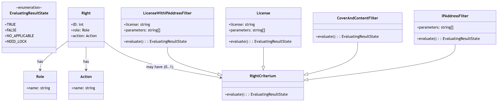

[Úvod](../../../index.md) > [Reference](../../index.md)  / [Zabezpečení](../index.md)

# Security Data Model

Tato část popisuje databázový model používaný pro autorizaci v Krameriovi.

Model zahrnuje tabulky pro:

- role mapping
- rights
- criteria assignment

Součástí je také SQL schéma, které je distribuováno uvnitř aplikace a používá se pro automatickou inicializaci databáze.

Všechny informace o právech, licencích, dodatečných podmínkách jsou ukládány v servisní databázi Postgres SQL a situaci nejlépe vystihuje následující diagram:

- ➡️ [Konfigurace pripojeni k databazi](../../../configuration/core/configuration-properties/configuration-database.md)

